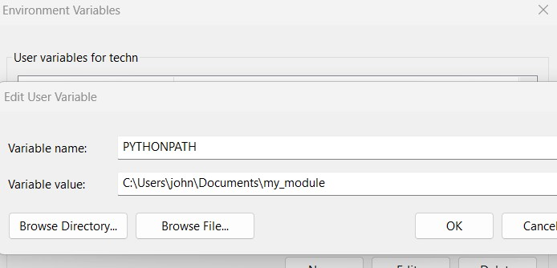
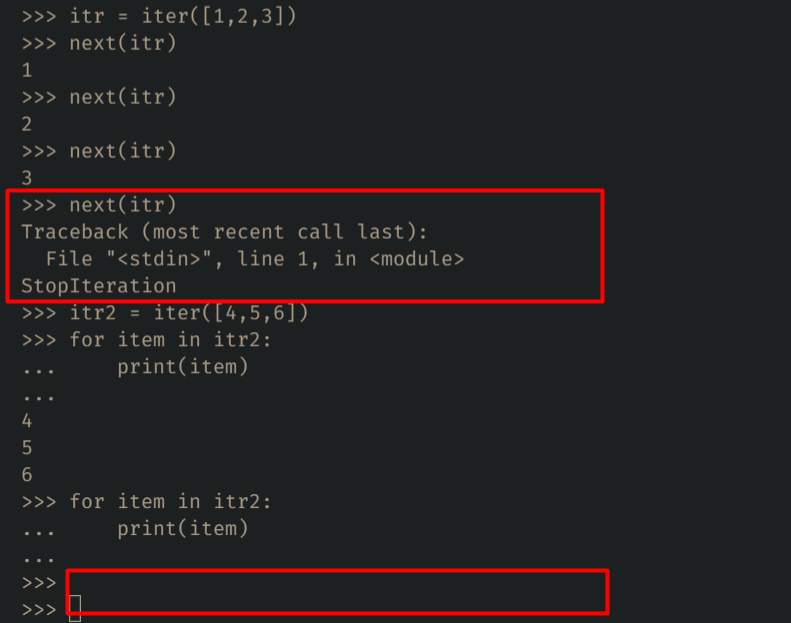
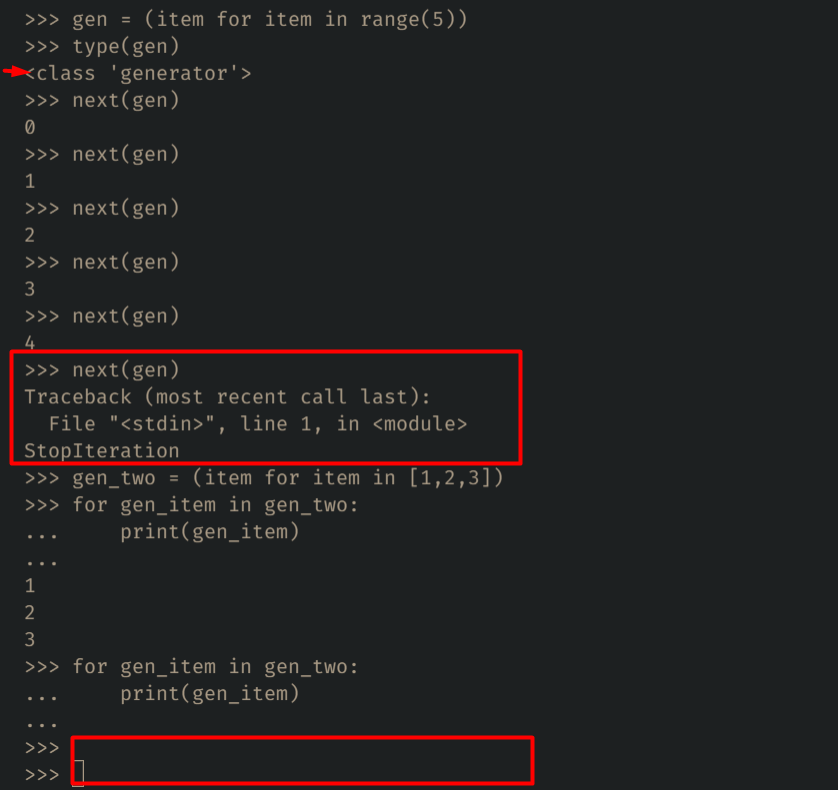

# Python Cheet Sheet

## Table of Contents

1. [Print Output](#print-output)
2. [Variable](#variable)
3. [Data Types & Type Conversion](#data-types--type-conversion)
4. [Control Flow & Short Handif](#control-flow--short-handif)
5. [Function & it's Arguments](#function--its-arguments)
    - [lambda](#lambda)
    - [Recursion](#recursion)
6. [Decorators](#decorators)
7. [For & While Loop](#for--while-loop)
    - [Loop Exception](#loop-exception)
8. [String](#string)
9. [List](#list)
10. [Tuple](#tuple)
11. [Set](#set)
12. [Dictionary](#dictionary)
13. [Map, Filter & List Comprehension](#map-filter--list-comprehension)
14. [File in Python](#file-in-python)
15. [Import & Export](#import--export)
16. [Iterators & Generators](#iterators--generators)
    - [yield & return](#yield--return)
17. [Error Handling](#error-handling)
18. [OOPs](#oops)
19. [Built-in Functions](#built-in-functions)
20. [Check Program Performance](#check-program-performance)
21. [Python Library](#python-library)
    - [datetime & timedelta](#datetime--timedelta)
    - [random & string](#random--string)
    - [faker](#faker)
    - [dataclasses](#dataclasses)
    - [collections](#collections)

## Print Output
```python
# Print Somthing
print("Hello World")  # Hello World

name = "John Doe"
age = 30
# Print Multiple Data
print(name, age)  # John Doe 30

# Print Horizontally - Default end="\n"
for item in range(5):
    print(item, end=' ')  # 0 1 2 3 4

# Escape Sequences
print("Hello \'World\'") # Hello 'World'
```

## Variable
```python
txt = "Hello World"
num = 2021
is_login = True
string = str(1)

# Assaign Multiple Variable
name, age = 'John Doe', 30
```
**[⬆ back to top](#table-of-contents)**

# Data Types & Type Conversion
### Data Types
```python
# Most Used Built-in Data Types in Python
1. str -> 'Hey'
2. int -> 100
3. float -> 10.1
4. bool -> True/False
5. list -> [1, 2, 3]
6. tuple -> (1, 2, 3)
7. set -> {1, 2, 3}
8. dict -> {'name': 'John Doe', 'age': 30}
9. range -> range(5)
10. complex -> 1j

# Type Checking Method
type([1, 2, 3]) # <class 'list'>
```

### Type Conversion
```python
int('100') # String -> Integer
list((1, 2, 3)) # Tuple -> List
tuple([1, 2, 3]) # List -> Tuple
set([1, 2, 3]) # List -> Set

# Also Change Data Type Using *
tpl = (1, 2, 3)
tpl_to_list = [*tpl]
print(tpl_to_list) # [1, 2, 3]
```
**[⬆ back to top](#table-of-contents)**

# Function & it's Arguments
```python
# Normal Function Defination
def add (num1, num2):
    return num1 + num2 
print(add(25, 10)) # 35

# Set a Default Argument
def say_hello (name, greeting="Hello"):
    return f"{greeting}, {name}"
print(say_hello("John", 'Hey')) # Hey, John
```

### Arguments
```python
# xargs => return a Tuple
def get_nums (*nums):
    return nums
print(get_nums(2, 3, 4, 5, 6)) # (2, 3, 4, 5, 6)

# xxargs => return a Dictionary
def get_data (**data):
    return data
print(get_data(name='John Doe', age=20)) # {'name': 'John Doe', 'age': 20}
```
**[⬆ back to top](#table-of-contents)**

## lambda
```python
# lambda arguments : expression
func1 = lambda x, y: x + y
print(func1(1, 2)) #3

func2 = lambda x, y=2: x + y
print(func2(1)) #3

func3 = lambda *args: args
print(func3(1, 2)) #(1, 2)

func4 = lambda **args: args
print(func4(name='John Doe', age=30)) #{'name': 'John Doe', 'age': 30}

# lmbda IIFE
(lambda num1, num2: num1 * num2)(10, 5)
```

## Recursion
```python
# Factorial Program
def factorial(num):
    if num == 1:
        return 1
    else:
        return num * factorial(num-1)

print(factorial(5)) # 120
```

**[⬆ back to top](#table-of-contents)**

# Decorators
```python
# before using decorator
def setup(func):
    def wrapper():
        print("Start Executing")
        func()
        print("End Executing")
    return wrapper

def test_login():
    print("Login Test")

setup(test_login)()
# or
result = setup(test_login)
result()
# Start Executing
# Login Test
# End Executing


# using decorators
def setup(func):
    def wrapper():
        print("Start Executing")
        func()
        print("End Executing")
    return wrapper

@setup
def test_login():
    print("Login Test")

test_login()
# Start Executing
# Login Test
# End Executing
```
```python
# parameterized decorated method
def before_after(func):
    def wrapper(*args, **kwargs):
        print("Before")
        func(*args, **kwargs)
        print("After")
    return wrapper

@before_after
def execute_script(feature):
    print(feature, "Script Executed")

execute_script("Login")
# Before
# Login Script Executed
# After
```
```python
# return decorated method
def setup(func):
    def wrapper(*args):
        print("Start Executing")
        val = func(*args)
        print("End Executing")
        return val
    return wrapper

@setup
def test_login(feature):
    return f"{feature} Test"

print(test_login("Login"))
# Start Executing
# End Executing
# Login Test
```
```python
# A good example of decorator
import time

def check_execution_time(func):
    def wrapper():
        before = time.time()
        func() 
        print(f"Execution Time = {time.time() - before} seconds")
    return wrapper

@check_execution_time
def take_rest():
    time.sleep(2)

take_rest() # Execution Time = 2.001185894012451 seconds
```
**[⬆ back to top](#table-of-contents)**

# Control Flow & Short Handif
```python
high_income, good_credit, student = True, True, True

if high_income and good_credit and not student:
    print("Eligible")
else:
    print("Not Eligible") # Not Eligible

# Chaining Comparison Operators
age = 35
if 18 < age < 65:
    print("Eligible") # Eligible
else:
    print("Not Eligible")
```

#### Short Hand if...else
```python
temperature = 45
weather = "Cold" if temperature <= 30 else "Warm" if 30 < temperature <= 60 else "Hot" # Warm
```
**[⬆ back to top](#table-of-contents)**

# For & While Loop
### While Loop
```python
counter = 0
while (counter <= 10):
    counter += 1
    if counter == 3:
        continue
    if counter > 5:
        break
    print(counter)  # 1 2 4 5
```

### For Loop
```python
for item in range(0, 11, 2):
    print(item, end=' ')  # Print Even: 0 2 4 6 8 10

# List Comprehension [Expression for item in items]
li = [item for item in range(1, 5)]
print(li) # [1, 2, 3, 4]
```

**[⬆ back to top](#table-of-contents)**

#### Loop Exception
**When loop completed, then the 'StopIteration Exception' & 'else' will be execute.**
```python
for item in range(1,4):
    print(item)
else:
    print('Item Finished!')
# 1 2 3
# Item Finished!
```
**If loop not finished, 'StopIteration Exception' & 'else' won't be executed.**
```python
for i in range(1, 5):
    if i > 3:
        break
    print(i)
else:
    print('Iteration Complete!')
# 1 2 3
```
**A Good Example of Loop Exception**
```python
def check_prime(num):
    for i in range(2, num):
        if num % i == 0:
            print(False)
            break
    else:
        print(True)

# print(check_prime(17)) # True
# print(check_prime(13)) # True
# print(check_prime(10)) # False
```

**[⬆ back to top](#table-of-contents)**

# String
> txt = "Hello World"
```python
print(txt[0], txt[-1]) # H d
print(txt[::-1]) # dlroW olleH
print(txt[4:1:-1]) # oll

print(txt.index('o')) # 4 (counting from Left)
print(txt.find('o')) # 4 (counting from Left)
print(txt.rindex('o')) # 7 (counting from Right)
print(txt.rfind('o')) # 7 (counting from Right)

print(txt.split(' ')) # ['Hello', 'world']
print(", ".join(txt.split(' '))) # Hello, world (join iterable elements into a string based on certain separator)

print(txt.replace('world', 'Python')) # Hello Python

print(txt.startswith('Hel')) # True
print(txt.endswith('H')) # False

print(txt.isdigit()) # False
print(txt.isnumeric()) # False

print(txt.upper()) # HELLO WORLD
print(txt.lower()) # hello world
print(txt.title()) # Hello World
print(txt.isupper(), txt.islower(), txt.istitle()) # False False False

print("Hell" in txt) # True
```
```python
# Translating String
data = ['John Doe', 'Chittagong-Bangladesh', '530 B-Block\nHalishahar']

formatted_data = [dt.translate(str.maketrans({' ': '_', '-': '_', '\n': '_'})).lower() for dt in data]
formatted_data # ['john_doe', 'chittagong_bangladesh', '530_b_block_halishahar']
```
```python
# String Formatting
msg = """
Hey {name}
How's it going?
"""
greeting = "Good {text}"

name = "John"
info = f"This is {name}"

msg.format(name="Joe") # Hey Joe\nHow's it going?
greeting.format(text="Morning") # Good Morning
info # This is John
```
**[⬆ back to top](#table-of-contents)**

# List
>li = [1, 2, 3, 4, 5] (Mutable & CRUD Possible)
#### Access the List Item
```python
li = [1, 2, 3, 4, 5]
print(li[1], li[-1]) # 2 5
print(li[1:3]) # [2, 3]
```
#### Concatenate List
```python
li1, li2 = [1, 2, 3], [4, 5, 6]

print(li1 + li2) # [1, 2, 3, 4, 5, 6]
print([*li1, *li2, 100]) # [1, 2, 3, 4, 5, 6, 100]

li1.extend(li2)
print(li1) # [1, 2, 3, 4, 5, 6]
```

#### Unpacking List
```python
employees = ['John', 'Doe', 'Mike', 'Clark', 'David']

first_employee, *others, last_employee = employees

print(first_employee, others, last_employee) # John ['Doe', 'Mike', 'Clark'] David
```

#### List Comprehension
```python
nums = [23, 33, 52, 65, 76, 28, 32]

even_nums = [num for num in nums if num % 2 == 0]
print(even_nums) # [52, 76, 28, 32]
```

### Add List Item
```python
names = ['John', 'Doe']

names.append('David') # ['John', 'Doe', 'David'] (add at Last)
names.insert(0, 'Mike') # ['Mike', 'John', 'Doe', 'David'] (add at any specific position)
```

### Remove List Item
```python 
names = ['Mike', 'John', 'Doe', 'David', 'Max', 'Joe', 'Root']

names.pop() # ['Mike', 'John', 'Doe', 'David', 'Max', 'Joe'] (remove item at Last)
names.pop(0) # ['John', 'Doe', 'David', 'Max', 'Joe'] (remove any item using index)
names.remove('John') # ['Doe', 'David', 'Max', 'Joe'] (remove any specific item)
del names[0:2] # ['Max', 'Joe'] (remove series of items)
names.clear() # [] (remove all items)
```
### Sort List Items
```python 
nums = [23, 33, 52, 65, 76, 28, 32]

print(nums.sort()) # None (only sort the list and return None not list)
print(nums) # [23, 28, 32, 33, 52, 65, 76]

print(sorted(nums)) # [23, 28, 32, 33, 52, 65, 76] (return a list after sorting)
print(sorted(nums, reverse=True)) # [76, 65, 52, 33, 32, 28, 23] (sorting DESC order)

# Sorting Little Complex List
products = [('product1', 75), ('product2', 124), ('product3', 44)]

products.sort(key=lambda pd: pd[1])
print(products) # [('product3', 44), ('product1', 75), ('product2', 124)]

products.sort(key=lambda pd: pd[1], reverse=True)
print(products) # [('product2', 124), ('product1', 75), ('product3', 44)]
```
#### Reverse List Items
```python
emp = ['John', 'Joe', 'Max']

print(emp[::-1]) # ['Max', 'Joe', 'John']
print(emp.reverse()) # None
print(emp) # ['Max', 'Joe', 'John']

print(reversed(emp)) # <list_reverseiterator object at 0x000001EEA63FAC20>
```
#### Other List Methods
```python
li = [32, 54, 32, 43]
print(li.index(32)) # 0
print(li.count(32)) # 2
```
```python
# print the index & value using enumerate()
nums = [23, 33, 52, 65]
for index, value in enumerate(nums):
    print(index, value)
# 0 23
# 1 33
# 2 52
# 3 65
```
```python
# Check the List item existance
names = ['John', 'Doe', 'Foo', 'Bar']
print('John' in names) # True
```
```python
# Shortcut Create List
similar_nums = [4] * 10
print(similar_nums) # [4, 4, 4, 4, 4, 4, 4, 4, 4, 4]
```
**[⬆ back to top](#table-of-contents)**

# Tuple
Tuple => (Immutable & Read Only, Not possible to add, modify & delete item)
>tpl = (10, 20, 30, 40, 50, 60)
>nums = 32, 42 or age = 32,

#### Access the Tuple Item
```python
tpl = (10, 20, 30, 40, 50, 60)
print(tpl[2:5]) # (30, 40, 50)
```

#### Unpack the Tuple Item
```python
users = ("Joe", "John", "Root", "Justin", "Foo")

user_one, *other_users, last_user = users 
print(user_one, other_users, last_user) # Joe ['John', 'Root', 'Justin'] Foo
```

#### Tuple Methods
```python
# Find the index of Tuple
users = ("Joe", "John", "Root", "Justin", "Joe")

print(users.index('John')) # 1
print(users.count('Joe')) # 2
print('Joe' in users) # True
```

#### Tuple Comprehension => Generator (Faster)
```python
# Create a Generator using Tuple Comprehension
users = ("Joe", "John", "Root", "Justin", "Foo")

gen = (item for item in users)
print(type(gen)) # <class 'generator'>
```
**[⬆ back to top](#table-of-contents)**

# Set
Set => Remove Duplicate, Possible to add, remove, delete item but not able to access specific item because it has no order
>nums = {2, 3, 4, 5, 6}

### Remove the Duplicate item of List & Tuple
```python
print(set((22, 23, 22, 23))) # {22, 23}
print(set([54, 50, 50, 55])) # {50, 54, 55}
```

#### Set Methods
```python
nums = {2, 3, 4, 5, 6}

nums.add(10) # {2, 3, 4, 5, 6, 10}
nums.pop() # {3, 4, 5, 6, 10}
nums.remove(5) # {3, 4, 6, 10}
nums.clear() # set()
```
### Mathmatical Operation Using Set
#### Union
```python
a_set = {1, 2, 3, 4}
b_set = {2, 4, 5, 6}
print(a_set | b_set) # {1, 2, 3, 4, 5, 6}
# or
print(a_set.union(b_set)) # {1, 2, 3, 4, 5, 6}
```

#### Intersection
```python
a_set = {1, 2, 3, 4}
b_set = {2, 4, 5, 6}
print(a_set & b_set) # {2, 4}
# or
print(a_set.intersection(b_set)) # {2, 4}
```

#### Difference
```python
a_set = {1, 2, 3, 4}
b_set = {2, 4, 5, 6}
print(a_set - b_set) # {1, 3}
# or
print(a_set.difference(b_set)) # {1, 3}
```

#### Symmetric Difference
```python
a_set = {1, 2, 3, 4}
b_set = {2, 4, 5, 6}
print(a_set ^ b_set) # {1, 3, 5, 6}
# or
print(a_set.symmetric_difference(b_set)) # {1, 3, 5, 6}
```
**[⬆ back to top](#table-of-contents)**

# Dictionary
>person = { 'name': 'John Doe', 'country': 'USA', 'age': 30 }

#### Access Dictionary Item
```python
person = { 'name': 'John Doe', 'country': 'USA', 'age': 30 }

print(person['name']) # John Doe (Throw KeyError exception, if key is not exist)
print(person.get('name')) # John Doe
```
#### Dictionary Comprehension
```python
user = {'name': 'Joe', 'email': 'joe@joe.com', 'phone': '456-888-2223'}

usr_data = [data for _, data in user.items()]
print(usr_data) # ['Joe', 'joe@joe.com', '456-888-2223']

nums = {x: x * x for x in range(1, 6)}
print(nums) # {1: 1, 2: 4, 3: 9, 4: 16, 5: 25}
```

#### Dictionary Methods
```python
person = { 'name': 'John Doe', 'country': 'USA', 'age': 30 }

person['city'] = 'Brooklyn' # {'name': 'John Doe', 'country': 'USA', 'age': 30, 'city': 'Brooklyn'} (dict key should be unique)
person.pop('age') # {'name': 'John Doe', 'country': 'USA', 'city': 'Brooklyn'}
person.update({'name': 'Joe', 'email': 'joe@joe.com'})
# {'name': 'Joe', 'country': 'USA', 'city': 'Brooklyn', 'email': 'joe@joe.com'}
person.clear() # {}
```
```python
person = { 'name': 'John Doe', 'country': 'usa', 'age': 30 }

print(person.keys()) # dict_keys(['name', 'country', 'age'])
print(person.values()) # dict_values(['John Doe', 'usa', 30])
print(person.items()) # dict_items([('name', 'John Doe'), ('country', 'usa'), ('age', 30)])
```
#### Loop in Dictionary
```python
# Print the Keys of Dictionary
person = { 'name': 'John Doe', 'country': 'usa', 'age': 30 }
for key in person:
    print (key) # name country age
# Print the Values of Dictionary
for key in person:
    print (person[key]) # John Doe usa 30
```

**[⬆ back to top](#table-of-contents)**

# Map, Filter & List Comprehension
```python
products = [('product1', 75), ('product2', 124), ('product3', 44)]

# Map VS List Comprehension (Pythonic)
product_prices = list(map(lambda pd: pd[1], products)) # [75, 124, 44]
pd_prices = [price for _, price in products] # [75, 124, 44]

# Filter VS List Comprehension
costly_products = list(filter(lambda pd: pd[1] > 50, products)) # [('product1', 75), ('product2', 124)]
costly_products = [pd for pd in products if pd[1] > 50] # [('product1', 75), ('product2', 124)]
```

**[⬆ back to top](#table-of-contents)**

# File in Python

#### Write in a File
```python
with open('hello.txt', 'w') as fp:
    fp.write('Hello World\n')
    fp.write('Another Text\n')
    fp.write('Python is Awesom\n')
```
#### Read a File
```python
with open('hello.txt', 'r') as fp:
    print(fp.read())
# Hello World
# Another Text
# Python is Awesom
```
#### Loop throw the line of file using readlines()
```python
lines = []
with open('hello.txt', 'r') as fp:
    for line in fp.readlines():
        lines.append(line)
print(lines) 
# ['Hello World\n', 'Another Text\n', 'Python is Awesom\n']
```
#### Read the First Line using readline()
```python
with open('hello.txt', 'r') as fp:
    print(fp.readline())
# Hello World
```
#### Add a new line in a Existing File using Append Mode
```python
with open('hello.txt', 'a') as fp:
    fp.write('Another line added in append mode')

with open('hello.txt', 'r') as fp:
    print(fp.read())
# Hello World
# Another Text
# Python is Awesom
# Another line added in append mode
```

**[⬆ back to top](#table-of-contents)**

# Import & Export
```python
import my_module
my_module.find_index()

import my_module as mm
mm.find_index()

from my_module import find_index
find_index()

from my_module import find_index as fi # Ambiguous => not recommended
fi()

from my_module import * # Ambiguous => not recommended
find_index()
```
**Use Custom Module in Anywhere**
We can import a module by adding the path of it as `PYTHONPATH` in `User variables`.
`Key => PYTHONPATH`
`Value => c:\users\john\documents\my_module` 

  
 
 ```python
# To see which paths are looking for importing module
import sys
sys.path
 ```

**[⬆ back to top](#table-of-contents)**

# Iterators & Generators
**Iterators**
  

**Generators**
 

### yield & return
|yield                             |return                         
|----------------------------------|-------------------------------
|provide output and continue       |provide output and stop           
|gives back a generator            |gives a return value and stop            
|keeps the states of local variable|destroys the states of local variable
|not exit the function             |exit the function

yield statement actually pause the execution of function and store the value in local scope and continue this process by next() method sincie yield convert a function to a generator.
> **Why Generator:** When we only care about the current value, not worry about the before, after or all values, then we can go with Generator. because it only cares about the current value not the whole data. so it's more memory efficient.
```python
def sqr_num(n):
    for i in range(1, n + 1):
        yield i * i

for i in sqr_num(5): # default behavior of for loop => iter(range(5))
    print(i) # default behavior of for loop => next(iterable)
```
**[⬆ back to top](#table-of-contents)**

# Error Handling
|Keyword   |Definition                         
|----------|-------------------------------
|try       |`will try to execute the script/code`            
|except    |`will execute once any exception found`            
|else      |`will execute if no exection found`
|finally   |`always it will execute - exception found or not`
```python
def get_div(a, b):
    try: 
        result = a / b
    except ZeroDivisionError:
        print("You can't divided by Zero")
    except TypeError:
        print("You can't divided by String")
    else:
        print(result)
    finally:
        print('Operation is Completed!')

get_div(3, 5)
# 0.6
# Operation is Completed!

get_div(3, 0)
# You can't divided by Zero
# Operation is Completed!

get_div(3, '4')
# You can't divided by String
# Operation is Completed!
```

**[⬆ back to top](#table-of-contents)**

# OOPs
#### Class Object, Instance Object -> Person, ps
>Example
```python
class Person:
    lang = 'English'
    
    # __init__ is working like a constructor in other lang.
    def __init__(self, name, age, gender):
        self.name = name
        self.age = age
        self.gender = gender

    # self is instance obj. It must be provided other wise method doesn't work perfectly
    def get_summary(self):
        return f"Name: {self.name}, Age: {self.age}, Gender: {self.gender}"

ps = Person('John Doe', 25, 'Male')    
print(ps) # <__main__.Person object at 0x7ff86530b040>
print(ps.__dict__) # {'name': 'John Doe', 'age': 25, 'gender': 'Male'}
print(ps.name) # John Doe
print(ps.get_summary()) # Name: John Doe, Age: 25, Gender: Male
```
```python
# create class dynamically by using type()
# farmula: ClassName = type('ClassName', (Parent1, Parent2), {}/dict() => to create property)
Person = type('Person', (Animal), {'lang': 'English', 'name': 'John'})
p = Person() # <__main__.Person object at 0x000001F325CB0B20>
```

#### Class vs Instance Property
```python
class Person:
    person_id = 1000
    
    def __init__(self, name, email):
        self.name = name
        self.email = email
        Person.person_id += 1

    def get_data(self):
        return f"ID: {self.person_id}, Name: {self.name}, Email: {self.email}"

    @classmethod
    def generate_dummy(cls):
        return cls("Dummy", "dummy@dummy.com")


person1 = Person("Joe", "joe@joe.com")
print(person1.get_data()) # ID: 1001, Name: Joe, Email: joe@joe.com

person2 = Person("John", "john@john.com")
print(person2.get_data()) # ID: 1002, Name: Joe, Email: joe@joe.com

dummy = Person.generate_dummy()
print(dummy.get_data()) # ID: 1003, Name: Dummy, Email: dummy@dummy.com
```
#### Object Comparision using Magic Methods
```python
class Square:
    def __init__(self, length):
        self.length = length 
        self._area = self.length * self.length
    
    @property
    def area(self):
        return self._area 

    @area.setter
    def area(self, val):
        self._area = val 

    def __eq__(self, other):
        return self.length == other.length

    def __gt__(self, other):
        return self.length > other.length

    def __add__(self, other):
        return f"Square({self.length + other.length})"


sq1 = Square(5)
sq2 = Square(3)
print(sq1.area) # 25
sq1.area = 100 # 100
print(sq1.area)

print(sq1 == sq2) # False
print(sq1 > sq2) # True
print(sq1 < sq2) # False
print(sq1 + sq2) # Square(8)
```
**[⬆ back to top](#table-of-contents)**

#### Encapsulation
Protect the code from unwanted access. variable should be private and based on need getter and setter method should be created
```python
class Author:
    def __init__(self):
        self.__authors = {}

    def add_author_post(self, author):
        self.__authors[author.lower()] = self.__authors.get(author.lower(), 0) + 1

    def __getitem__(self, author):
        return self.__authors.get(author.lower(), 0)

    def __setitem__(self, author, post_count):
        self.__authors[author.lower()] = post_count

    def __len__(self):
        return len(self.__authors)

    def __iter__(self):
        return iter(self.__authors)

    def __str__(self):
        return str(self.__authors)


author = Author()
author.add_author_post('John')
author.add_author_post('john')
author.add_author_post('joe')
author['mike'] = 15

print(author) # {'john': 2, 'joe': 1, 'mike': 15}
print(len(author)) # 3
print(author['john']) # 2

for author in author:
    print(author) # john joe mike
```
**[⬆ back to top](#table-of-contents)**

#### Inheritance
Transfer common data from parent class to child class. Python supports multiple inheritance.
```python
class Person:
    def __init__(self, name, email):
        self.name = name
        self.email = email

class Employee(Person):
    def dream(self):
        pass 

class Teacher(Person):
    def teach(self):
        pass

class EmployeeTeacher(Employee, Teacher):
    pass


emp = Employee("Joe", "joe@joe.com")
print(isinstance(emp, Person)) # True
print(isinstance(emp, Employee)) # True
print(issubclass(Person, object)) # True
print(issubclass(Employee, Person)) # True
```
```python
# Extending Built-in Types by Inheritance
class ListLogger(list):
    def append(self, obj):
        print("append called.")
        super().append(obj)

list = ListLogger()
list.append(100) # append called.
print(list) # [100]
```
**[⬆ back to top](#table-of-contents)**
#### Abstraction
Hide the implementation part, showing only the outcome. It's like HALF BAKED COOKIES, not ready to eat. can't create object for Abstract class.
```python
from abc import ABC, abstractmethod


class InvalidOperationError(Exception):
    pass

class Stream(ABC):
    def __init__(self):
        self.opened = False

    def open(self):
        if self.opened:
            raise InvalidOperationError("Stream already open")
        self.opened = True

    def close(self):
        if not self.opened:
            raise InvalidOperationError("Stream already close")
        self.opened = False

    @abstractmethod
    def read(self):
        pass 


class FileStream(Stream):
    def read(self):
        print("Reading Data from File")

class NetworkStream(Stream):
    def read(self):
        print("Reading Data from Network")
```
**[⬆ back to top](#table-of-contents)**

#### Method Overriding
```python
class Rectangle:
    def __init__(self, height, width):
        self.height = height
        self.width = width
    
    def get_area(self):
        return self.height * self.width

class Square(Rectangle):
    def __init__(self, size):
        self.size = size

    def get_area(self):
        return self.size * self.size

rc = Rectangle(5, 4)
print(rc.get_area()) # 20

sq = Square(5)
print(sq.get_area()) # 25
```
**[⬆ back to top](#table-of-contents)**

# Built-in Functions
### Most Used Python Builtin Functions

#### all()
all() retuns False, if any the of iterable object item is Falsy, Otherwise it returns True
```python
print(all([])) # True
print(all([1, 2, 3])) # True
print(all([1, 2, 0])) # False
```

#### any()
any() returns False, if all of the iterable object item is Falsy or empty iterable like [], () etc. Otherwise it returns True
```python
print(any([])) # False
print(any([1, 2, 3])) # True
print(any([1, 2, 0])) # True
print(any([0, False, ''])) # False
```
#### map()
```python
def get_double(item):
    return item + item
mapped = map(get_double, [2, 3, 4])
print(mapped) # <map object at 0x0000023AF5BCA1F0>
# Readable map object
print(list(mapped)) # [4, 6, 8]

# Implement Map with magic lambda function
mapped_obj = map(lambda x: x + x, [2, 3, 4])
mapped_list = list(mapped_obj)
print(mapped_list) # Same [4, 6, 8]

# or Simply 
print(list(map(lambda x: x + x, [2, 3, 4]))) # [4, 6, 8]

# We Can pass multiple iterable object as arg
print(list(map(lambda first_li_item, seccond_li_item: first_li_item + seccond_li_item, [1, 2, 3], [100, 200, 300])))
# [101, 202, 303]
```

#### filter()
```python
def get_adult(age):
    if age > 18:
        return age
filtered_age_obj = filter(get_adult, [22, 10, 12, 40, 32, 33, 15])
print(filtered_age_obj) # <filter object at 0x00000261B6F6A1F0>
filtered_age_list = list(filtered_age_obj)
print(filtered_age_list) # [22, 40, 32, 33]

# Implement filter() using lambda function
filtered_obj = filter(lambda age: age > 18, [22, 10, 12, 40, 32, 33, 15])
filtered_list = list(filtered_obj)
print(filtered_list) # [22, 40, 32, 33]

# Or Simply print in one line
print(list(filter(lambda age: age > 18, [22, 10, 12, 40, 32, 33, 15])))
# Exactly Same [22, 40, 32, 33]
```

#### sorted()
```python
# default sorted function -> sorted(iterable, key=None, reverse=False)

# smaller -> bigger
print(sorted([11, 2, 43, 10, 50, 5, 7])) #[2, 5, 7, 10, 11, 43, 50]

# bigger -> smaller
print(sorted([11, 2, 43, 10, 50, 5, 7], key=None, reverse=True)) 
#[50, 43, 11, 10, 7, 5, 2]
```

#### reversed()
```python
print(list(reversed([32,22,31]))) # [31, 22, 32]
print(tuple(reversed((32,22,31)))) # (31, 22, 32)
print(list(reversed((32,22,31)))) # [31, 22, 32]

# Reverse string
print(''.join(reversed('Hello World'))) # dlroW olleH
```

#### len()
```python
print(len([2,3,4])) # 3
print(len({'name': 'John', 'age': 30}))  # 2
print(len('Hello'))  # 5
```

#### enumerate()
```python
bd_players = ['Tamim Iqbal', 'Moshfiqur Rahim', 'Sakib Al Hasan', 'Mashrafi Mortaza', 'Mahmudullah Riad']
# Start Default -> 0
print(list(enumerate(bd_players, start=1)))
# [(1, 'Tamim Iqbal'), (2, 'Moshfiqur Rahim'), (3, 'Sakib Al Hasan'), (4, 'Mashrafi Mortaza'), (5, 'Mahmudullah Riad')]
```

#### zip()
Pack the multiple iterable object
```python
bd_players = ['Tamim Iqbal', 'Moshfiqur Rahim', 'Sakib Al Hasan', 'Mashrafi Mortaza', 'Mahmudullah Riad']
runs = [23, 55, 75, 10, 34]
wickets = [0, 0, 4, 2, 3]

print(list(zip(bd_players, runs, wickets)))
# [('Tamim Iqbal', 23, 0), ('Moshfiqur Rahim', 55, 0), ('Sakib Al Hasan', 75, 4), ('Mashrafi Mortaza', 10, 2), ('Mahmudullah Riad', 34, 3)]
```

#### min(), max()
```python
print(min([5, 2, 8, 1])) # 1
print(max([5, 2, 8, 1])) # 8
```

### Math Related Built-in Functions

#### sum()
```python
print(sum([2, 3, 5])) # 10
print(sum((2, 3, 5))) # 10
print(sum({2, 3, 5})) # 10

# We can define a start value as 2nd arg
print(sum([2, 3], 10)) # 15
```
#### divmod()
divmod() takes two int as arguments and returns a tuple of two numbers where the 1st number is the quotient and the 2nd is the remainder.
```python
print(divmod(10, 3)) # (3, 1)
```

#### abs()
```python
print(abs(-1)) # 1
```

#### round()
```python
print(round(12.20)) # 12
print(round(12.55)) # 13
```

#### pow()
```python
print(pow(3,2)) # 9
print(pow(3,3)) # 27
print(pow(5,2)) # 25
```

#### min()
```python
print(min(3, 2, 4, 7)) # 2
print(min([5, 2, 8, 1])) # 1
```

#### max()
```python
print(max([5, 2, 8, 1])) # 8
print(max(10, 2, 8, 1)) # 10
```

#### range()
```python
print([*range(5)]) # [0, 1, 2, 3, 4]
print([*range(0, 5, 2)]) # [0, 2, 4]
```

#### format()
```python
print(format(10, '.2%')) # 1000.00%
print(format(100, 'b')) # 1100100 (Binary of 100)
print(format(100, 'o')) # 144 (Octal of 100)
print(format(1000, 'x')) # 3e8 (hex of 1000)
print(format(1000, 'X')) # 3E8 (hex of 1000)
print(format(10.0040, '.1f')) # 10.0
print(format(100000, ',')) # 100,000
print(format(100000, 'n')) # 100000
print(format(3.13592, '.2g')) # 3.1
```

#### eval()
```python
print(eval('2 + 5')) # 7
```

**[⬆ back to top](#table-of-contents)**

### Int -> Unicode & Unicode -> Int
>chr(), ord()
```python
print(ord('a')) # 97
print(chr(97))  # a
```

### Built-in Functions for Iterators
>iter(), next()
iter() function is used to create iterable object & next() is used to access the item of Iterable Object.
```python
itr = iter([5,2,3])
print(type(itr)) # <class 'list_iterator'>
print(next(itr)) # 5
```

### Input & Ouput
```python
name = input('Please type your name: ')
print(name)
```

#### Number System Related Built-in Functions
>int(), bin(), oct(), hex(), format(value, first chr of number system)
```python
print(int('10')) # 10
print(type(int('10'))) # <class 'int'>
print(int(0b1010)) # 10
print(bin(10)) # 0b1010
print(oct(70)) # 0o106
print(hex(1000)) # 0x3e8
print(format(1000, 'x')) # 3e8 (hex of 1000)
```

**[⬆ back to top](#table-of-contents)**

### Experimental Built-in Functions

#### dir()
dir() function returns list of the attributes and methods of any object like functions , modules, strings, lists, dictionaries etc. If no argument passed, it returns the list of names in the current local scope.
```python
print(dir()) 
# ['__annotations__', '__builtins__', '__cached__', '__doc__', '__file__', '__loader__', '__name__', '__package__', '__spec__']

print(dir(list))
# ['__add__', '__class__', '__contains__', '__delattr__', '__delitem__', '__dir__', '__doc__', '__eq__', '__format__', '__ge__', '__getattribute__', '__getitem__', '__gt__', '__hash__', '__iadd__', '__imul__', '__init__', '__init_subclass__', '__iter__', '__le__', '__len__', '__lt__', '__mul__', '__ne__', '__new__', '__reduce__', '__reduce_ex__', '__repr__', '__reversed__', '__rmul__', '__setattr__', '__setitem__', '__sizeof__', '__str__', '__subclasshook__', 'append', 'clear', 'copy', 'count', 'extend', 'index', 'insert', 'pop', 'remove', 'reverse', 'sort']

print(dir(tuple))
# ['__add__', '__class__', '__contains__', '__delattr__', '__dir__', '__doc__', '__eq__', '__format__', '__ge__', '__getattribute__', '__getitem__', '__getnewargs__', '__gt__', '__hash__', '__init__', '__init_subclass__', '__iter__', '__le__', '__len__', '__lt__', '__mul__', '__ne__', '__new__', '__reduce__', '__reduce_ex__', '__repr__', '__rmul__', '__setattr__', '__sizeof__', '__str__', '__subclasshook__', 'count', 'index']
```

#### vars()
>vars() provides the built in function provided by python standard library.
>The vars() function returns the __dic__ attribute of an object.
>The __dict__ attribute is a dictionary containing the object's changeable attributes.
```python
name = "Justin"

print(vars())
# {'__name__': '__main__', '__doc__': None, '__package__': None, '__loader__': <_frozen_importlib_external.SourceFileLoader object at 0x7f5182a994c0>, '__spec__': None, '__annotations__': {}, '__builtins__': <module 'builtins' (built-in)>, '__file__': 'Program/builtin.py', '__cached__': None, 'name': 'Justin'}

print(vars(list))
# {'__repr__': <slot wrapper '__repr__' of 'list' objects>, '__hash__': None, '__getattribute__': <slot wrapper '__getattribute__' of 'list' objects>, '__lt__': <slot wrapper '__lt__' of 'list' objects>, '__le__': <slot wrapper '__le__' of 'list' objects>, '__eq__': <slot wrapper '__eq__' of 'list' objects>, '__ne__': <slot wrapper '__ne__' of 'list' objects>, '__gt__': <slot wrapper '__gt__' of 'list' objects>, '__ge__': <slot wrapper '__ge__' of 'list' objects>, '__iter__': <slot wrapper '__iter__' of 'list' objects>, '__init__': <slot wrapper '__init__' of 'list' objects>, '__len__': <slot wrapper '__len__' of 'list' objects>, '__getitem__': <method '__getitem__' of 'list' objects>, '__setitem__': <slot wrapper '__setitem__' of 'list' objects>, '__delitem__': <slot wrapper '__delitem__' of 'list' objects>, '__add__': <slot wrapper '__add__' of 'list' objects>, '__mul__': <slot wrapper '__mul__' of 'list' objects>, '__rmul__': <slot wrapper '__rmul__' of 'list' objects>, '__contains__': <slot wrapper '__contains__' of 'list' objects>, '__iadd__': <slot wrapper '__iadd__' of 'list' objects>, '__imul__': <slot wrapper '__imul__' of 'list' objects>, '__new__': <built-in method __new__ of type object at 0x905e20>, '__reversed__': <method '__reversed__' of 'list' objects>, '__sizeof__': <method '__sizeof__' of 'list' objects>, 'clear': <method 'clear' of 'list' objects>, 'copy': <method 'copy' of 'list' objects>, 'append': <method 'append' of 'list' objects>, 'insert': <method 'insert' of 'list' objects>, 'extend': <method 'extend' of 'list' objects>, 'pop': <method 'pop' of 'list' objects>, 'remove': <method 'remove' of 'list' objects>, 'index': <method 'index' of 'list' objects>, 'count': <method 'count' of 'list' objects>, 'reverse': <method 'reverse' of 'list' objects>, 'sort': <method 'sort' of 'list' objects>, '__doc__': 'Built-in mutable sequence.\n\nIf no argument is given, the constructor creates a new empty list.\nThe argument must be an iterable if specified.'}
```

#### globals()
It always returns the global scope data. either inside of funtion of outside of a function.
```python
name = "Justin"
print(globals())
# Output {'__name__': '__main__', '__doc__': None, '__package__': None, '__loader__': <_frozen_importlib_external.SourceFileLoader object at 0x7f69628e04c0>, '__spec__': None, '__annotations__': {}, '__builtins__': <module 'builtins' (built-in)>, '__file__': 'Program/builtin.py', '__cached__': None, 'name': 'Justin'}
```

#### locals()
It returns only function local scope data, if we use it inside a function
if we use it in globle scope, it will react like globals() - I mean, return the global scope data.
```python
name = "Justin"
print(locals())
# Output {'__name__': '__main__', '__doc__': None, '__package__': None, '__loader__': <_frozen_importlib_external.SourceFileLoader object at 0x7f69628e04c0>, '__spec__': None, '__annotations__': {}, '__builtins__': <module 'builtins' (built-in)>, '__file__': 'Program/builtin.py', '__cached__': None, 'name': 'Justin'}

def diff_locals_and_globals():
    age = 20
    print(globals())
    print(locals())

diff_locals_and_globals()
# globals() Output -> {'__name__': '__main__', '__doc__': None, '__package__': None, '__loader__': <_frozen_importlib_external.SourceFileLoader object at 0x7fe5c69dc4c0>, '__spec__': None, '__annotations__': {}, '__builtins__': <module 'builtins' (built-in)>, '__file__': 'Program/builtin.py', '__cached__': None, 'name': 'Justin', 'diff_locals_and_globals': <function diff_locals_and_globals at 0x7fe5c6885dc0>}

# locals() Output -> {'age': 20}
```

#### id()
id() is a adresss of the object in memory. It returns the unique identity of an object.
```python
print(id('John')) # 140434664974640
print(id(10)) # 9788896
print(id([21, 54, 65])) # 139834604658304
print(id({'name': 'Doe'})) # 140615104266112
```

**[⬆ back to top](#table-of-contents)**

### Access the Object property 
>hasattr() setattr(), getattr(), delattr()
```python
class Person:
    pass
ps = Person()
print(hasattr(ps, 'name')) # False
setattr(ps, 'name', 'John Foo')
print(hasattr(ps, 'name')) # True
print(getattr(ps, 'name')) # John Foo
delattr(ps, 'name')
print(hasattr(ps, 'name')) # False
```

### Builtin Function for Checking

#### bool()
bool() is used to check the Truthy & Falsy value
```python
print(bool(0)) # False
print(bool(1)) # True
print(bool([]), bool([100, 200])) # False True
```

#### type()
type() is used to check the data type
```python
print(type('he he')) # <class 'str'>
print(type(['hey', 'hello'])) # <class 'list'>
print(type(20)) # <class 'int'>
```

#### isinstance(), issubclass()
```python
class Rectangle:
    def __init__(self, height, width):
        self.height = height
        self.width = width
    
    def get_area(self):
        return self.height * self.width

class Square(Rectangle):
    pass

rc = Rectangle(5, 4)
sq = Square(5, 5)
print(isinstance(rc, Rectangle)) # True
print(isinstance(sq, Rectangle)) # True
print(isinstance(sq, Square)) # True
print(isinstance(rc, Square)) # False

print(issubclass(Square, Rectangle)) # True
print(issubclass(Rectangle, Square)) # False
```

### Other Built-in Functions
```python
open()
__import__
ascii()
slice()
callable()
help()
hash()
breakpoint()
exec()
classmethod()
super()
property()
bytes()
bytearray()
object()
memoryview()
staticmethod()
repr()
compile()
complex()
```

**[⬆ back to top](#table-of-contents)**

# Check Program Performance
> Compare the List & Deque Efficiency in the time of adding data at 0 index.
```python
from timeit import timeit
from collections import deque

li = [item for item in range(10000)]
dq = deque(li)

print(timeit('li.insert(0, 100)', number=100000, globals=globals()))
# 2.143603781998536

print(timeit('dq.appendleft(100)', number=100000, globals=globals()))
# 0.006301867000729544
```

**[⬆ back to top](#table-of-contents)**

# Python Library
## datetime & timedelta
|   Directive     |     Example     |   Directive   |     Example    
|-----------------|-----------------|---------------|--------------
|`%a`|Sun         |`%A`             |Sunday 
|`%d`|01 (day)    |`%m`             |01 (month)        
|`%b`|Jan         |`%B`             |January
|`%y`|13 (year)   |`%Y`             |2013 (year)
|`%H`|13 (24 hour)|`%I`             |1 (12 hour)
|`%p`|AM, PM      |`%Z`             |EST, PST
|`%M`|59 (minutes)|`%S`             |45 (seconds)
```python
from datetime import datetime
import time

dt1 = datetime(2010, 1, 2) # 2010-01-02 00:00:00 (datetime object for specific date)
dt2 = datetime.now() # 2022-11-11 20:35:15.133546 (datetime object for now)
dt = datetime.fromtimestamp(time.time()) # 2022-11-11 20:35:15.133547 (create datetime obj from timestamp)

print(dt) # 2022-11-11 20:44:14.250334
print(f"{dt.month}/{dt.day}/{dt.year}") # 11/11/2022
print(dt2 > dt1) # True
```
```python
# convert a string into datetime object
dt = datetime.strptime("2018-01-21", "%Y-%m-%d") # 2018-01-21 00:00:00 

# convert a datetime obj into string
year_month = dt.strftime("%Y-%m") # 2018-01 
```
```python
# timedelta
from datetime import datetime, timedelta

dt1 = datetime(2010, 1, 2) + timedelta(days=3) # 2010-01-05 00:00:00 
dt2 = datetime.now() # 2022-11-11 20:56:34.348977
print(dt1)
print(dt2)

td = dt2 - dt1 # datetime - datetime => timedelta
print(td) # 4693 days, 20:56:34.348977
print(td.days) # 4693
print(td.seconds) # 75394
print(td.total_seconds()) # 405550594.348977
```
**[⬆ back to top](#table-of-contents)**
## random & string
```python
import random

random.random() # 0.6709288725924469 (generate randomly floating number)
random.randint(100, 110) # 105 (random number from a range)

# randomly picks a value from a sequential
random.choice([21, 43, 65, 76]) # 43 
# randomly picks more than one value based on 'k'
random.choices([21, 43, 65, 76], k=3) # [65, 43, 65] 

nums = [1, 2, 3, 4, 5]
random.shuffle(nums) # changed the order randomly
print(nums) # [5, 1, 2, 4, 3]
```
```python
# a good example
import string, random

combined_string = string.ascii_letters + string.digits + string.punctuation
print(combined_string) 
# abcdefghijklmnopqrstuvwxyzABCDEFGHIJKLMNOPQRSTUVWXYZ0123456789!"#$%&'()*+,-./:;<=>?@[\]^_`{|}~

strong_password = "".join(random.choices(combined_string, k=8))
print(strong_password) # WA3k*?D5
print(strong_password) # R?BGDNj<
```
**[⬆ back to top](#table-of-contents)**

## faker
```python
from faker import Faker

fake = Faker('en-US') # faker obj for English
fake = Faker()

fake.name() # Richard Guzman
fake.unique.name() # Nancy Hurst (Every names should be unique Once create multiplas within single shot)
fake.first_name() # Tammy
fake.last_name() # Barnes
fake.email() # daltonreyes@example.org
fake.safe_email() # michaelhess@example.org
fake.phone_number() # (122)127-6210x4172
fake.image_url() # https://placeimg.com/614/408/any
fake.ssn() # 781-02-4026

fake.address() # 78917 Jon Suite 271 Port Duaneview, HI 40684
fake.city() # South Karenchester
fake.zipcode() # 20893
fake.country() # Norway
```
```python
fake.bothify("???-###", letters="MAXI") # XIX-218 (? => letters, # => digits)
fake.random_int(min=10, max=20) # 16
fake.csv() # "Rodney Castaneda","869 Port Christopherland, KS 76525"
fake.json() # [{"name": "Joseph Smith", "residency": "930 Madison Extension, OH 93947"}]

fake.date() # 1981-05-02
fake.past_date() # 2022-10-22
fake.future_date() # 2022-11-21
```
```python
from faker import Faker
from faker.providers import BaseProvider
from faker.providers import DynamicProvider

fake = Faker()

class MyProvider(BaseProvider):
    def age(self) -> int:
        return fake.random_int(min=0, max=100)

# add new provider to faker instance
fake.add_provider(MyProvider)
print(fake.age()) # 41

# or without following class
test_status = DynamicProvider(
     provider_name="test_status",
     elements=["Passed", "Failed", "Skipped"],
)

fake.add_provider(test_status)
print(fake.test_status()) # Failed (randomly picks one like random.choice())
```
**[⬆ back to top](#table-of-contents)**
## dataclasses
@dataclass is one of the best practice, if our class is data based or data focused. It automitacally creates the init, repr, eq method for a class. no need to explicitly create those those method.

- **default behaviour:** `@dataclass(*, init=True, repr=True, eq=True, order=False, unsafe_hash=False, frozen=False)`
- if you want do comparison like `__gt__, __ge__, __lt__, __le__`, then you've to make the order as True. ex: `@dataclass(order=True)`
- by default dataclasss' properties are mutable, we can change/set the property's value. if you want to make it immutable, then frozen should be True. ex: `@dataclass(frozen=True)`
- unsafa_hash control the hash value. by default it's false. if you want to generate the hash value of your dataclass object, then you've to make the unsafe_hash as True. ex: `@dataclass(unsafe_hash=True)`
- inside dataclass if we create property with type, those property automitacally goes into `__init__` method as instance propery not class property.
- `__post_init__` as name says, it can easily access the properties of `__init__` method or whatever propery created inside dataclass with type. Auto generated `__init__()` method of dataclass automitacally calls the `__post_init__()`, if it is exist inside dataclass. `__post_init__` method is triggered Once `__init__()` is done.
- **field:** field helps to change the default behavior dataclass property. ex:
```python 
from dataclasses import dataclass, field
obj.__dataclass_fields__ # to see all the fields of dataclass
obj.__dataclass_fields__['age'] # to see specific field

@dataclass
class Investor:
	name: str
	age: int
	cash: float field(repr=False, campare=True, default=10.0)

@dataclass
class Person:
	name: str
	city: str
	age: int
	is_senior_citizen: bool = field(init=False)
	
	def __post_init__(self):
		if age > 60:
			is_senior_citizen=True
		else:
			is_senior_citizen=False
```
**DataClass Inheritance:** if you property are common between Parent class & Child class. The parent class propery should be replaced by child class property.
```python
@dataclass
class Person:
	name: str
	city: str
	age: int

@dataclass
class Student(Person)
	std_id: int
	std_email: str

s = Student("John", "Brooklyn", 25, "1001", "john@email.com")
```
**A Good Example**
```python
from dataclasses import dataclass

@dataclass
class Person:
    name: str 
    email: str 
    age: int 
    country: str 

    def __post_init__(self):
        for key, val in self.__dict__.items():
            if key != 'age':
                setattr(self, key, val.upper())


_dataclass = Person(*['John', 'john@gmail.com', 30, 'USA'])
_dataclass # Person(name='JOHN', email='JOHN@GMAIL.COM', age=30, country='USA')
```
and
```python
from dataclasses import make_dataclass

def get_data():
    tpl_list = [('name', str), ('email', str), ('age', int), ('country', str)]

    return make_dataclass('Person', 
    tpl_list, 
    namespace={
        '__post_init__': lambda self: [setattr(self, k, v.upper()) for k, v in self.__dict__.items() if not (k == 'age')]
    })

person_data = ['John Doe', 'john@gmail.com', 30, 'USA']
_dataclass = get_data()

data_elements = _dataclass(*[dt for dt in person_data])
data_elements # Person(name='JOHN DOE', email='JOHN@GMAIL.COM', age=30, country='USA')
```


**[⬆ back to top](#table-of-contents)**
## collections
#### OrderedDict
After python 3.7, python dictionary is able to maintain insertion order like OrderedDict. So, now you can maintain insertion order using python dictionary. OrderedDict has some extra feature though
```python
from collections import OrderedDict 


std_ids = [("john", "342"), ("joe", "654"), ("max", "976"), ("mike", "102")]

# can pass iterator obj as argument
ord_dict = OrderedDict(std_ids)
# OrderedDict([('john', '342'), ('joe', '654'), ('max', '976'), ('mike', '102')])

ord_dict.move_to_end('john')
# OrderedDict([('joe', '654'), ('max', '976'), ('mike', '102'), ('john', '342')])

ord_dict.popitem()
# OrderedDict([('joe', '654'), ('max', '976'), ('mike', '102')])
```
#### namedtuple
It's bahaving like a tuple (Immutable) but it's more readable and optimized.
```python
from collections import namedtuple 

# normal tpl
admin = ('admin', 'password')
admin[0] # admin

# namedtuple
User = namedtuple('User', ['username', 'password'])
admin = User("admin", "******")
editor = User(username="editor", password="******")

admin.username # admin
editor.username # editor
```
we can get same readability by using dictionary but it's more verbose. everytime to create a new user we need to use keys but in namedtuple it's optional. if we want we can use keys or we can skip it. and in python dictionary we can't access the value by using . syntax.

```python
from collections import namedtuple 

# namedtuple
User = namedtuple('User', ['username', 'password'])
admin = User("admin", "******")
editor = User(username="editor", password="******")
admin.username # admin
editor.username # editor

# dictionary
admin = {"username": "admin", "password": "******"}
editor = {"username": "editor", "password": "******"}
admin['username'] # admin
```
**[⬆ back to top](#table-of-contents)**
